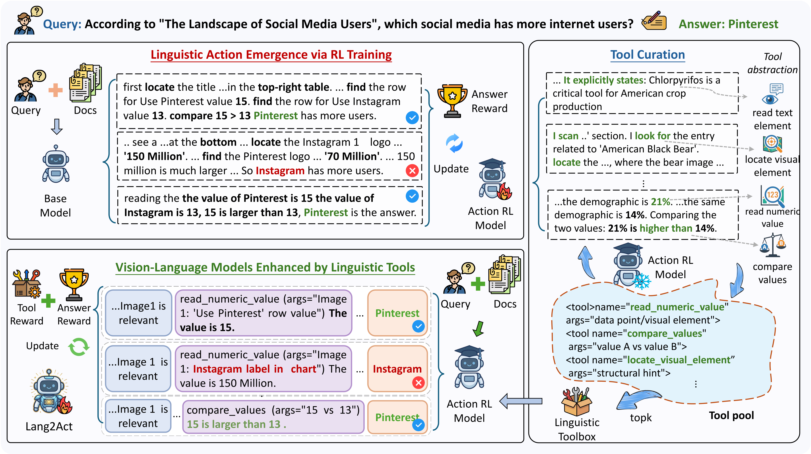

# Lang2Act: Fine-Grained Visual Reasoning through Self-Emergent Linguistic Toolchains

Source code for our paper:
**Lang2Act: Fine-Grained Visual Reasoning through Self-Emergent Linguistic Toolchains**
<div align="center">

[](https://arxiv.org/abs/2501.xxxxx)
[](https://huggingface.co/xiongyq/Lang2Act-7B)
[](https://huggingface.co/datasets/xiongyq/Lang2Act-Train)

</div>
<p align="center">•
 <a href="#-overview"> 📖 Overview </a> •
 <a href="#️-setup">⚙️ Setup</a> •
 <a href="#️-training">⚡️ Training </a> •
 <a href="#-inference">🔧 Inference </a>
 <br>
 <a href="#-evaluation">📃 Evaluation </a> •
 <a href="#-quick-start">🚀 Quick Start </a> •
 <a href="#contact">📧 Contact</a> 
</p>

## 📖 Overview

Lang2Act is a novel framework for Visual Retrieval-Augmented Generation (VRAG) that enables fine-grained visual perception and reasoning through self-emergent linguistic toolchains. Instead of relying on rigid and decoupled external tools that often introduce visual information loss, Lang2Act internalizes visual actions as linguistic tools generated and executed directly by the Vision-Language Model (VLM), allowing perception and reasoning to be unified in a single autoregressive process.

## ⚙️ Setup

```bash
conda create -n Lang2Act python=3.10
conda activate Lang2Act
git clone https://github.com/NEUIR/Lang2Act.git
cd Lang2Act
pip install -r requirements.txt
```
## ⚡️ Training  

> **Note:** If you do not want to train the model from scratch, you may  skip this section and directly proceed to [Inference](#-inference) and [Evaluation](#-evaluation)

Our training pipeline is built upon [EasyR1](https://github.com/hiyouga/EasyR1) and follows a two-stage reinforcement learning paradigm designed to induce effective visual actions and structured linguistic toolchains. All training data used for Lang2Act is publicly available on [Hugging Face](https://huggingface.co/datasets/xiongyq/Lang2Act-Train).

### Stage 1: Action-Level Reinforcement Learning

In the first stage, the model is optimized to explore and acquire fine-grained visual actions, enabling it to localize, read, and reason over visual elements in a task-driven manner.

```bash
bash scripts/run_actionrl.sh
```
### Stage 2: Toolchain-Level Reinforcement Learning
In the second stage, the model is further trained to exploit the discovered actions by composing them into coherent linguistic toolchains, which support multi-step visual reasoning and answer generation.
```bash
bash scripts/run_toolsrl.sh
```

## 🔧 Inference

To perform inference with a trained Lang2Act model:
```
bash scripts/predict.sh
```
> **Note:** The inference script uses a trained Lang2Act checkpoint and automatically downloads the required test datasets from [Hugging Face](https://huggingface.co/datasets/xiongyq/Lang2Act-Test-vidoseek).


## 📃 Evaluation
We use an LLM-as-a-Judge mechanism to evaluate the correctness of the generated answers. The evaluation script calls a powerful model (e.g., Qwen2.5-72B-Instruct) to compare predictions against ground truth.
### 1. Set Environment Variable
If you want to judge the prediction with APIs, you must export your SiliconFlow API key before running the evaluation:

```
export SILICONFLOW_API_KEY="your_actual_api_key"
```
### 2. Run Evaluation Script
You can run the evaluation using the provided shell script. You can pass a specific inference file as an argument:
```
bash scripts/eval.sh
```

## 🚀 Quick Start
Model on Hugging Face: https://huggingface.co/xiongyq/Lang2Act-7B

```python
from transformers import AutoProcessor
from vllm import LLM, SamplingParams
from qwen_vl_utils import process_vision_info

Lang2Act_PROMPT_TEMPLATE = (
    "You are a specialized AI assistant for visual question answering.\n"
    "Your task is to answer the user's question by analyzing the provided images.\n\n"
    "Your response must strictly follow this XML format:\n"
    "<think>...</think>\n"
    "<description>...</description>\n"
    "<answer>...</answer>\n\n"
    "Guidance for each tag:\n"
    "1.  `<think>`: Analyze all {num_images} images and state which image(s) are relevant to the question.\n"
    "2.  `<description>`: Focusing *only* on the selected image(s), describe your evidence-gathering steps using the tools below.\n"
    "3.  `<answer>`: Provide only the final, concise answer.\n\n"
    "Available Tools for `<description>`:\n"
    "  - `<tool name=\"locate_visual_element\" args=\"Image k: structural hint/description\">Locate specific visual elements or regions.</tool>`\n"
    "  - `<tool name=\"read_text_element\" args=\"Image k: locator/region\">Read and transcribe visible text.</tool>`\n"
    "  - `<tool name=\"read_numeric_value\" args=\"Image k: data point/visual element\">Extract numeric values.</tool>`\n"
    "  - `<tool name=\"identify_entity_attribute\" args=\"Image k: entity\">Identify entity attributes.</tool>`\n"
    "  - `<tool name=\"compare_values\" args=\"Image k: value A vs value B\">Compare values.</tool>`\n"
    "  - `<tool name=\"compute_percentage\" args=\"part_value, total_value\">Compute percentages.</tool>`\n"
    "  - `<tool name=\"infer_missing_information\" args=\"Image k: existing data\">Infer missing information.</tool>`\n\n"
)

model_path = "xiongyq/Lang2Act-7B"

processor = AutoProcessor.from_pretrained(
    model_path,
    trust_remote_code=True,
    padding_side="left"
)

imgs = ["imgpath1", "imgpath2", "...", "imgpathN"]
query = "What xxx?"
input_prompt = Lang2Act_PROMPT_TEMPLATE.format(num_images=len(imgs)) + f"\nQuestion: {query}"

content = [{"type": "text", "text": input_prompt}]
for img_path in imgs:
    content.append({
        "type": "image",
        "image": img_path
    })

messages = [{
    "role": "user",
    "content": content,
}]

llm = LLM(
    model=model_path,
    tensor_parallel_size=1,
    dtype="bfloat16",
    limit_mm_per_prompt={"image": 5, "video": 0},
)

sampling_params = SamplingParams(
    temperature=0.1,
    repetition_penalty=1.05,
    max_tokens=2048,
)

prompt = processor.apply_chat_template(
    messages,
    tokenize=False,
    add_generation_prompt=True,
)

image_inputs, _ = process_vision_info(messages)

inputs = [{
    "prompt": prompt,
    "multi_modal_data": {"image": image_inputs},
}]

outputs = llm.generate(
    inputs,
    sampling_params=sampling_params,
)

print(outputs[0].outputs[0].text)

```
## Acknowledgement
Our work is built on the following codebases, and we are deeply grateful for their contributions.
- [EasyR1](https://github.com/hiyouga/EasyR1)
- [vllm](https://github.com/vllm-project/vllm)

## 📧 Contact
If you have questions, suggestions, and bug reports, please give us an issue or email:
```
yqxiong54@gmail.com
```
